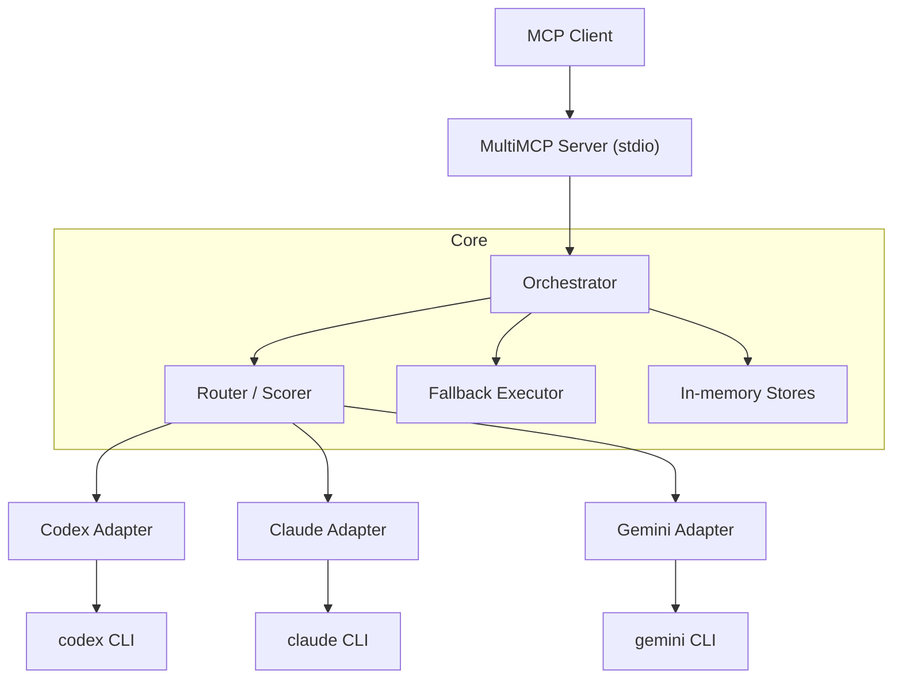

# 🌉 MultiMCP v2

[](LICENSE)
[](https://github.com/katarmal-ram/multimcp)

MultiMCP는 MCP(Model Context Protocol) 클라이언트 요청을 `codex` / `claude` / `gemini` CLI로 라우팅하는 멀티-브리지 오케스트레이터입니다.

현재 저장소는 모노레포 형태로 아래 패키지를 포함합니다.

- `@multimcp/core`: 라우팅, 폴백, 오케스트레이션 핵심 로직
- `@multimcp/mcp-server`: stdio 기반 MCP 서버
- `@multimcp/cli`: `multimcp` 커맨드(doctor + 도구 실행)
- `@multimcp/web`: placeholder 패키지

## 🏗️ 아키텍처



## ✨ 현재 구현 상태

- **지원 브리지**: `codex`, `claude`, `gemini`
- **지원 명령**: `review`, `plan`, `fix`, `debate`, `memory`, `cost`
- **MCP 툴**: `multimcp_review`, `multimcp_plan`, `multimcp_fix`, `multimcp_debate`, `multimcp_memory`, `multimcp_cost`
- **자동 선택**: `model_selector=auto`
- **하이브리드 토론**: `model_selector=hybrid` + `participants`
- **브리지 폴백**: 실패 시 fallback 체인으로 재시도
- **프롬프트 보호**: 최대 길이 제한 + 기본 민감정보 마스킹(DLP)

> [!IMPORTANT]
> - 세션/이벤트/토론 저장소는 현재 `in-memory` 구현입니다.
> - MCP 서버 부트스트랩은 `.cowork/db` 디렉터리 생성/권한 확인까지 수행합니다.

## 🛠️ 요구사항

- Node.js `>=22`
- pnpm `>=9`
- (실브리지 사용 시) `codex` / `claude` / `gemini` CLI 설치 및 인증

## 🚀 로컬 설치 및 실행

```bash
corepack pnpm install
corepack pnpm -r build
```

**CLI 실행 예시:**

```bash
node packages/cli/dist/bin.js doctor
node packages/cli/dist/bin.js review --model-selector codex --prompt "review this patch"
node packages/cli/dist/bin.js debate --model-selector hybrid --participants claude,codex,gemini --question "tradeoff?"
```

**MCP 서버 실행 예시:**

```bash
node packages/mcp-server/dist/bin.js --list-tools
```

## ⚙️ MCP 설정 예시

`.mcp.json` 또는 MCP 클라이언트 설정에 로컬 빌드 결과를 직접 연결:

```json
{
  "mcpServers": {
    "multimcp": {
      "command": "node",
      "args": ["/ABSOLUTE/PATH/TO/multi_llm_mcp/packages/mcp-server/dist/bin.js"],
      "env": {
        "MULTIMCP_USE_REAL_BRIDGES": "1",
        "MULTIMCP_MODEL_PROFILE": "compat"
      }
    }
  }
}
```

## 🔧 환경 변수

| 변수 | 설명 | 기본값 |
| :--- | :--- | :--- |
| `MULTIMCP_USE_REAL_BRIDGES` | `1`이면 실제 CLI 브리지 사용, 아니면 mock 브리지 사용 | `0` |
| `MULTIMCP_PROJECT_DIR` | `.cowork/db` 부트스트랩 기준 경로 | `process.cwd()` |
| `MULTIMCP_MODEL_PROFILE` | codex 모델 프로필 (`default`/`compat`) | `default` |
| `MULTIMCP_CODEX_MODEL` | codex 기본 모델 강제 지정 | profile 기반 자동 선택 |
| `MULTIMCP_CLAUDE_MODEL` | claude 기본 모델 지정(실브리지) | `claude-sonnet-4` |
| `MULTIMCP_GEMINI_MODEL` | gemini 기본 모델 지정(실브리지) | `gemini-2.5-flash-lite` |
| `MULTIMCP_CODEX_FALLBACK_MODELS` | codex 폴백 모델 목록(콤마 구분) | 자동 + `gpt-5-codex` |
| `MULTIMCP_CLAUDE_FALLBACK_MODELS` | claude 폴백 모델 목록(콤마 구분) | 없음 |
| `MULTIMCP_GEMINI_FALLBACK_MODELS` | gemini 폴백 모델 목록(콤마 구분) | 없음 |
| `MULTIMCP_REAL_BRIDGE_E2E` | 실브리지 통합 테스트 활성화 플래그 | 테스트 시에만 사용 |
| `MULTIMCP_REAL_BRIDGE_TEST_TIMEOUT_MS` | 실브리지 테스트 타임아웃(ms) | `240000` |

## 📡 stdio 프로토콜 (MCP 서버 내부)

서버는 한 줄 JSON 명령을 stdin으로 받고 한 줄 JSON 응답을 stdout으로 출력합니다.

**요청 예시:**

```json
{ "action": "list_tools" }
{ "action": "call_tool", "tool": "multimcp_review", "input": { "model_selector": "auto", "prompt": "..." } }
```

## ✅ 테스트

```bash
corepack pnpm lint
corepack pnpm -r typecheck
corepack pnpm test
corepack pnpm test:mcp-gate
```

실브리지 통합 테스트:

```bash
corepack pnpm test:real-bridges
```

## 📄 문서

- [구현 목표 (Implementation Goals)](docs/IMPLEMENTATION_GOAL.md)
- [PRD](docs/PRD.md)
- [TRD](docs/TRD.md)
- [운영 런북 (Operations Runbook)](docs/OPERATIONS_RUNBOOK.md)
- [릴리즈 요약 (Release Summary)](docs/RELEASE_SUMMARY.md)

## ⚖️ 라이선스

MIT (`LICENSE`)
